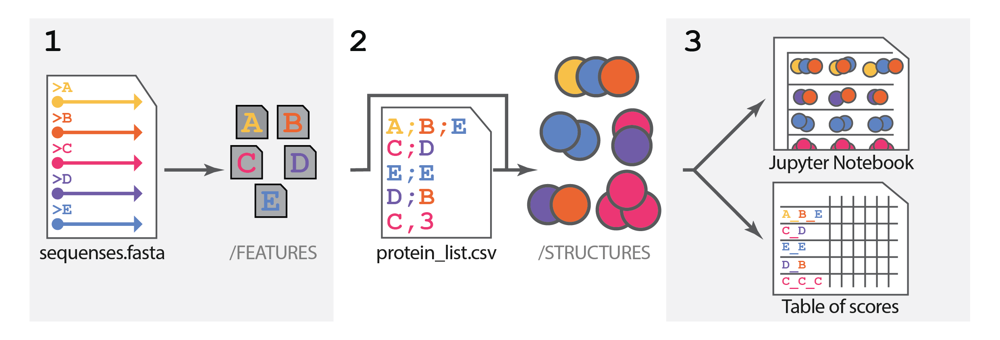

# AlphaPulldown Manual

`[add version]`<br>
> __Note__: AlphaPulldown fully **maintains backward compatibility** with input files and scripts from versions 1.x. For instructions on using older files and scripts, please refer to the sections marked "Older Version."``
## About AlphaPulldown

AlphaPulldown is an implementation of [AlphaFold-Multimer](https://github.com/google-deepmind/alphafold) designed for customizable high-throughput screening of protein-protein interactions. Besides, AlphaPulldown provides additional customizations of the AlphaFold which include custom structural templates, MMseqs2 multiple sequence alignment (MSA), protein fragment predictions, and implementation of cross-link mass spec data using [AlphaLink2](https://github.com/Rappsilber-Laboratory/AlphaLink2/tree/main), [add Integrates experimental models into AlphaFold pipeline using custom multimeric databases].

 
The original AlphaFold-Multimer end-to-end protein complex prediction pipeline may be split into two main steps: **(1)** the databases search step that generates Features and MSA and **(2)** protein structure prediction itself. AlphaPluldown executes these steps as independent scripts which is more suitable for modeling a large number of protein complexes. Additionally, **(3)** AlphaPluldown provides two options for the downstream analysis of the resulting protein models.

Let's take a closer look at the AlphaPuldown pipeline:


1) **Features and MSA**: At this step for every queried protein sequence AlphaFold searches for preinstalled databases using HMMER and calculates multiple sequence alignment (MSA) for all finden homologues. Additionally, AlphaFold searches for homolog structures that will be used as templates for features generation. This step requires only CPU to run.<be>
There are a few customizable options for this step:

   * To speed up the search process MMSeq2 ${\color{red} [add link]}$ instead of HHMER can be used.<br>
   * Use custom MSA ${\color{red} [add link]}$.
   * _NEW:_ Use a custom structural template ${\color{red} [add link]}$. Including true multimer.
  

2) **Structure prediction**: At this step, the AlaphaFold neural network runs and produces the final protein structure, which requires GPU computational powers.
   Here, AlphaPulldown allows:
   * Read all combinations of proteins to predict from one file
   * Specify the number of residues that correspond to the part of the protein you want to predict
   * Adjust MSA depth (allows control over how much the initial MSA influences the final model)
   * Crosslinking data implementation with [AlphaLink2](https://github.com/Rappsilber-Laboratory/AlphaLink2/tree/main).

3) **Results analysis**: The results for all predicted models could be systematized using one of the following two options:
   * Table that contains various scores and physical parameters of protein complexes' interaction.
   * Jupyter notebook with interactive 3D models and PAE plots.

## Installation [link]

<details>

<summary><b>
 Databases directory
</b></summary>

### You can add a header

You can add text within a collapsed section. 

You can add an image or a code block, too.

```ruby
   puts "Hello World"
```

</details>

## Compute multiple sequence alignment (MSA) and template features (CPU stage)
TBD
## Predict structures (GPU stage)

## Analysis and Visualization
### Results table
### Jupyter notebook

## SnakeMake running
