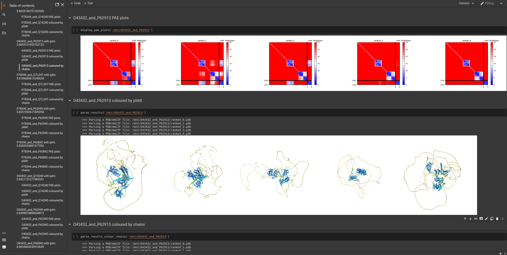
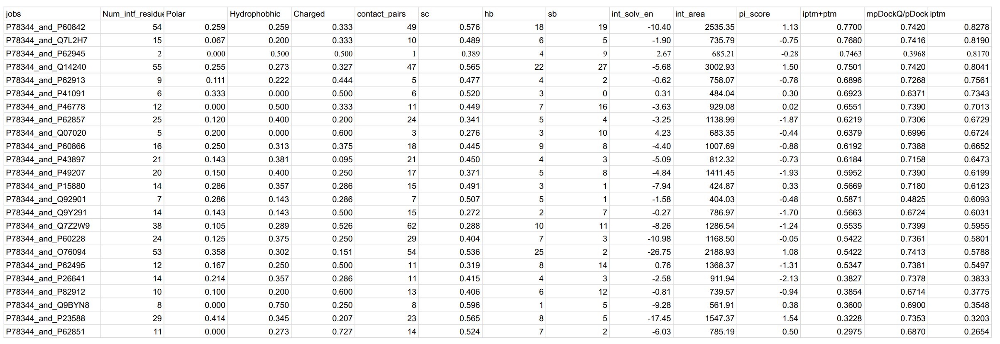

# Example1
# Aim: Find proteins involving human translation pathway that might interact with eIF4G2 

## 1st step: compute multiple sequence alignment (MSA) and template features (run on CPUs)

For the purpose of this manual, the expected file is already provided here: [```./example_data/example_1_sequences.fasta```](./example_data/example_1_sequences.fasta). If you want to run a smaller test, you can use [```./example_data/example_1_sequences_shorter.fasta```](./example_data/example_1_sequences_shorter.fasta) instead.


:memo: *The example file was generated by downloading all 294 proteins that belong to human translation pathway from: [Reactome](https://reactome.org/PathwayBrowser/#/R-HSA-72766&DTAB=MT). eIF4G2 sequence was downloaded from (Uniprot:[P78344](https://www.uniprot.org/uniprot/P78344)).*

### Run using default AlphaFold databases (slower):

```bash
source activate AlphaPulldown
create_individual_features.py \
  --fasta_paths=baits.fasta,example_1_sequences.fasta \
  --data_dir=<path to alphafold databases> \
  --save_msa_files=False \
  --output_dir=<dir to save the output objects> \ 
  --use_precomputed_msas=False \
  --max_template_date=<any date you want, format like: 2050-01-01> \
  --skip_existing=False \
  --seq_index=<any number you want or skip the flag to run all one after another>
```

### Run using MMseqs2 and ColabFold databases (faster):

MMSeqs2 and ColabFold allow for much quicker calculation of MSAs than the default AlphaFold method above. To use MMSeqs2 in AlphaPulldown, please refer to [this manual](./mmseqs2_manual.md).

:memo: Please be aware that MMseqs2/ColabFold and AlphaFold/HHBlits methods give different MSAs. Therefore, the resulting models may be also different. However, the models from these two pipelines usually have a comparable accuracy.

### Expected output
```create_individual_features.py``` will compute necessary features each protein in [```./example_data/example_1_sequences.fasta```](./example_data/example_1_sequences.fasta) and store them in the ```output_dir```. Please be aware that everything after ```>``` will be 
taken as the description of the protein and **please be aware** that any special symbol, such as ```| : ; #```, after ```>``` will be replaced with ```_```. 

The name of the pickles will be the same as the descriptions of the sequences  in fasta files (e.g. ">protein_A" in the fasta file will yield "protein_A.pkl")

### Running on a computer cluster in parallel

On a compute cluster, you may want to run all jobs in parallel as a [job array](https://slurm.schedmd.com/job_array.html). For example, on SLURM queuing system at EMBL we could use the following ```create_individual_features_SLURM.sh``` script:

```bash
#!/bin/bash

#A typical run takes couple of hours but may be much longer
#SBATCH --job-name=array
#SBATCH --time=10:00:00

#log files:
#SBATCH -e logs/create_individual_features_%A_%a_err.txt
#SBATCH -o logs/create_individual_features_%A_%a_out.txt

#qos sets priority
#SBATCH --qos=low

#Limit the run to a single node
#SBATCH -N 1

#Adjust this depending on the node
#SBATCH --ntasks=8
#SBATCH --mem=64000

module load HMMER/3.3.2-gompic-2020b
module load HH-suite/3.3.0-gompic-2020b
module load Anaconda3
source activate AlphaPulldown

create_individual_features.py \
  --fasta_paths=baits.fasta,example_1_sequences_shorter.fasta \
  --data_dir=/scratch/AlphaFold_DBs/2.2.2/ \
  --save_msa_files=False \
  --output_dir=/scratch/user/output/features \
  --use_precomputed_msas=False \
  --max_template_date=2050-01-01 \
  --skip_existing=True \
  --seq_index=$SLURM_ARRAY_TASK_ID
```
and then run using:

```
mkdir logs
#Count the number of jobs corresponding to the number of sequences:
baits=`grep ">" baits.fasta | wc -l`
candidates=`grep ">" example_1_sequences_shorter.fasta | wc -l`
count=$(( $baits + $candidates ))
#Run the job array, 100 jobs at a time:
sbatch --array=1-$count%100 create_individual_features_SLURM.sh
```

 ------------------------

## Explanation about the parameters
####  **```save_msa_files```** 
By default is **False** to save storage stage but can be changed into **True**. If it is set to ```True```, the programme will 
create individual folder for each protein. The output directory will look like:
```
 output_dir
      |- protein_A.pkl
      |- protein_A
            |- uniref90_hits.sto
            |- pdb_hits.sto
            |- etc.
      |- protein_B.pkl
      |- protein_B
            |- uniref90_hits.sto
            |- pdb_hits.sto
            |- etc.
 ```
 
 
If ```save_msa_files=False``` then the ```output_dir``` will look like:
 ```
 output_dir
      |- protein_A.pkl
      |- protein_B.pkl
 ```
 
 --------------------
 
 
 ####  **```use_precomputed_msas```**
 Default value is ```False```. However, if you have already had msa files for your proteins, please set the parameter to be True and arrange your msa files in the format as below:
 ```
 example_directory
      |- protein_A 
            |- uniref90_hits.sto
            |- pdb_hits.sto
            |-***.a3m
            |- etc
      |- protein_B
            |- ***.sto
            |- etc
 ```
Then, in the command line, set the ```output_dir=/path/to/example_directory```

####  **```skip_existing```**
Default is ```False``` but if you have run the 1st step already for some proteins and now add new proteins to the list, you can change ```skip_existing``` to ```True``` in the
command line to avoid rerunning the same procedure for the previously calculated proteins.

####  **```seq_index```**
Default is `None` and the programme will run predictions one by one in the given files. However, you can set ```seq_index``` to 
different number if you wish to run an array of jobs in parallel then the programme will only run the corresponding job specified by the ```seq_index```. e.g. the programme only calculate features for the 1st protein in your fasta file if ```seq_index``` is set to be 1. See also the Slurm sbatch script above for example how to use it for parallel execution.

:exclamation: ```seq_index``` starts from 1. 

---------------------

## 2nd step: Predict structures (run on GPU)

#### **Run in pulldown mode**
Inspired by pull-down assays, one can specify one or more proteins as "bait" and another list of proteins as "candidates". Then the programme will use AlphafoldMultimerV2 to predict interactions between baits (as in [example_data/baits.txt](./example_data/baits.txt)) and candidates (as in [example_data/candidates.txt](./example_data/candidates.txt)). 

**Note** If you want to save time and run fewer jobs, you can use [example_data/candidates_shorter.txt](./example_data/candidates_shorter.txt) instead of [example_data/candidates.txt](./example_data/candidates.txt) 

In this example, we selected pulldown mode and made eIF4G2(Uniprot:[P78344](https://www.uniprot.org/uniprot/P78344)) as a bait while the other 294 proteins as candidates. Thus, in total, there will be 1 * 294 = 294 predictions. 


The command line interface for using pulldown mode will then become:
```
run_multimer_jobs.py --mode=pulldown \
--num_cycle=3 \
--num_predictions_per_model=1 \
--output_path=<output directory> \ 
--data_dir=<path to alphafold databases> \ 
--protein_lists=baits.txt,candidates.txt \
--monomer_objects_dir=/path/to/monomer_objects_directory \
--job_index=<any number you want> --compress_result_pickles=True \
--remove_result_pickles=True
```

:memo: To reproduce the results of Lassa virus Z protein vs L protein fragments written in our paper, simply use [baits_Z_protein.txt](./example_data/baits_Z_protein.txt) and [L_protein_fragments.txt](./example_data/L_protein_fragments.txt) as the ```--protein_lists```inputs. This example shows also how to run the interaction screen for fragments of proteins, keeping the original full-length residue numbering in the output!

✨ **New Features** Now AlphaPulldown supports integrative structural modelling if the user has experimental cross-link data. Please refer to [this manual](run_with_AlphaLink2.md) if you'd like to model your protein complexes with cross-link MS data as extra input.

## Explanation about the parameters

####  **```monomer_objects_dir```**
It should be the same directory as ```output_dir``` specified in **Step 1**. It can be one directory or contain multiple directories if you stored pre-calculated objects in different locations. In the case of 
multiple ```monomer_objects_dir```, remember to put a `,` between each e.g. ``` --monomer_objects_dir=<dir_1>,<dir_2>```

####  **```job_index```**
Default is `None` and the programme will run predictions one by one in the given files. However, you can set ```job_index``` to 
different number if you wish to run an array of jobs in parallel then the programme will only run the corresponding job specified by the ```job_index```

:exclamation: ```job_index``` starts from 1

🆕 now can reduce the size of the output folders via ```remove_result_pickles``` and ```compress_result_pickles```

By default these 2 are set to False. ```compress_result_pickles=True``` will compress all the result pickles by gzip. ```remove_result_pickles=True``` will remove result pikles that do not belong to the best model. 

### Running on a computer cluster in parallel

On a compute cluster, you may want to run all jobs in parallel as a [job array](https://slurm.schedmd.com/job_array.html). For example, on SLURM queuing system at EMBL we could use the following ```run_multimer_jobs_SLURM.sh``` sbatch script:

```bash
#!/bin/bash

#A typical run takes couple of hours but may be much longer
#SBATCH --job-name=array
#SBATCH --time=2-00:00:00

#log files:
#SBATCH -e logs/run_multimer_jobs_%A_%a_err.txt
#SBATCH -o logs/run_multimer_jobs_%A_%a_out.txt

#qos sets priority
#SBATCH --qos=low

#SBATCH -p gpu
#lower end GPUs might be sufficient for pairwise screens:
#SBATCH -C "gpu=2080Ti|gpu=3090"

#Reserve the entire GPU so no-one else slows you down
#SBATCH --gres=gpu:1

#Limit the run to a single node
#SBATCH -N 1

#Adjust this depending on the node
#SBATCH --ntasks=8
#SBATCH --mem=64000

module load Anaconda3 
module load CUDA/11.3.1
module load cuDNN/8.2.1.32-CUDA-11.3.1
source activate AlphaPulldown

MAXRAM=$(echo `ulimit -m` '/ 1024.0'|bc)
GPUMEM=`nvidia-smi --query-gpu=memory.total --format=csv,noheader,nounits|tail -1`
export XLA_PYTHON_CLIENT_MEM_FRACTION=`echo "scale=3;$MAXRAM / $GPUMEM"|bc`
export TF_FORCE_UNIFIED_MEMORY='1'

run_multimer_jobs.py --mode=pulldown \
    --num_cycle=3 \
    --num_predictions_per_model=1 \
    --output_path=/scratch/user/output/models \
    --data_dir=/scratch/AlphaFold_DBs/2.2.2/ \
    --protein_lists=baits.txt,candidates_shorter.txt \
    --monomer_objects_dir=/scratch/user/output/features \
    --job_index=$SLURM_ARRAY_TASK_ID
```
and then run using:

```
mkdir -p logs
#Count the number of jobs corresponding to the number of sequences:
baits=`grep -c "" baits.txt` #count lines even if the last one has no end of line
candidates=`grep -c "" candidates_shorter.txt` #count lines even if the last one has no end of line
count=$(( $baits * $candidates ))
sbatch --array=1-$count example_data/run_multimer_jobs_SLURM.sh
```

--------------------


## 3rd step: Evalutaion and visualisation

**Feature 1**

When a batch of jobs is finished, AlphaPulldown can create a [Jupyter](https://jupyter.org/) notebook that presents a neat overview of the models, as seen in the example screenshot 

On the left side, there is a bookmark listing all the jobs and when clicking a bookmark, and executing the corresponding cells, the notebook will show: 1) PAE plots 2) predicted model coloured by pLDDT scores 3) predicted models coloured by chains.

In order to create the notebook, within the same conda environment, run:
```bash
source activate AlphaPulldown
cd <models_output_dir>
create_notebook.py --cutoff=5.0 --output_dir=<models_output_dir>
```
:warning: The command must be run within the ```<output_dir>```!

This command will yield an ```output.ipynb```, which you can open it via Jupyterlab. Jupyterlab is already installed when installing AlphaPulldown with pip. Thus, to view the notebook: 

```bash
source activate AlphaPulldown
cd <models_output_dir>
jupyter-lab output.ipynb
```
:memo: *If you run AlphaPulldown on a remote computer cluster, you will need a graphical connection to open the notebook in a browser, mount the remote directory to your local computer as a network directory, or copy the entire ```<models_output_dir>``` to the local computer.*

**About the parameters**

```cutoff``` is to check the value of PAE between chains. In the case of multimers, the analysis programme will create the notebook only from models with inter-chain PAE values smaller than the cutoff.

**Feature 2**

We have also provided a singularity image called ```alpha-analysis.sif```to generate a CSV table with structural properties and scores.
Firstly, download the singularity image: 

⚠️ If your results are from AlphaPulldown prior version 1.0.0: [alpha-analysis_jax_0.3.sif](https://www.embl-hamburg.de/AlphaPulldown/downloads/alpha-analysis_jax_0.3.sif). 

⚠️ If your results are from AlphaPulldown with version >=1.0.0: [alpha-analysis_jax_0.4.sif](https://www.embl-hamburg.de/AlphaPulldown/downloads/alpha-analysis_jax_0.4.sif). 
Chrome user may not be able to download it after clicking the link. If so, please right click and select "Save link as".


Then execute the singularity image (i.e. the sif file) by:
```
singularity exec \
    --no-home \
    --bind /path/to/your/output/dir:/mnt \
    <path to your downloaded image>/alpha-analysis_0.4.sif \
    run_get_good_pae.sh \
    --output_dir=/mnt \
    --cutoff=10
```

**About the outputs**
By default, you will have a csv file named ```predictions_with_good_interpae.csv``` created in the directory ```/path/to/your/output/dir``` as you have given in the command above. ```predictions_with_good_interpae.csv``` reports: 1. iptm, iptm+ptm scores provided by AlphaFold 2. mpDockQ score developed by[ Bryant _et al._, 2022](https://gitlab.com/patrickbryant1/molpc)  3. PI_score developed by [Malhotra _et al._, 2021](https://gitlab.com/sm2185/ppi_scoring/-/wikis/home). The detailed explainations on these scores can be found in our paper and an example screenshot of the table is below. 

------------------------------------------------------------
## Appendix: Instructions on running in all_vs_all mode
As the name suggest, all_vs_all means predict all possible pairwise comparisons within a single input file. The input can be either full-length proteins or regions of a protein, as illustrated in the [example_all_vs_all_list.txt](./example_data/example_all_vs_all_list.txt) and the figure below:


The corresponding command is: 
```bash
run_multimer_jobs.py \
  --mode=all_vs_all \
  --num_cycle=3 \
  --num_predictions_per_model=1 \
  --output_path=<path to output directory> \ 
  --data_dir=<path to AlphaFold data directory> \ 
  --protein_lists=example_all_vs_all_list.txt \
  --monomer_objects_dir=/path/to/monomer_objects_directory \
  --job_index=<any number you want>
```
